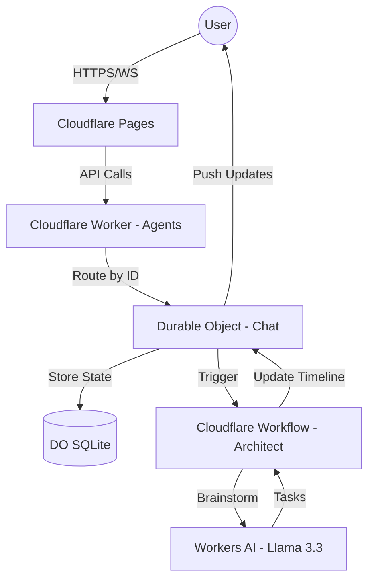

# Architecture Overview: cf_ai_temporal-flux

Temporal Flux is built using a **Cloudflare-Native** architecture designed for extreme performance, strong consistency, and global scalability.

## 1. The Tech Stack

- **Frontend:** React (Vite) + TypeScript + TailwindCSS + Radix UI.
  - Deployed on **Cloudflare Pages** for fast global delivery.
- **Backend API:** Cloudflare Workers using the **`agents`** package.
  - Handles routing and Durable Object mapping for AI sessions.
- **State Management:** **Cloudflare Durable Objects (DO)**.
  - Each session/user is mapped to a unique DO instance, ensuring strong consistency for that user's data.
- **Persistent Storage:** **DO SQLite**.
  - Durable Objects use an embedded SQLite database for high-performance, structured storage of the timeline and event logs.
- **AI Engine:** **Cloudflare Workers AI**.
  - Primarily using `@cf/meta/llama-3.3-70b-instruct-fp8-fast`.
- **Workflow Orchestration:** **Cloudflare Workflows**.
  - Handles multi-step AI reasoning (e.g., "Architecting" a goal into tasks) with built-in retries and state persistence.

## 2. State Management & The "Unified Timeline"

The core of Flux is the **Unified Timeline**, which combines strategy and execution into a single vertical sequence.

### Event-Driven State Logging

We implement an **Event-Driven** state model. While the primary source of truth is the current state projection stored in the Durable Object, we append records of every mutation to an immutable `events` log.

- **Status**: Currently a hybrid model (State Projection + Audit Log).
- **Benefits:** Provides a complete audit trail of AI and User decisions, enabling "Time Travel" debugging and a foundation for future Undo/Redo features.
- **Implementation**: Every tool call or state mutation triggers an event entry (e.g., `PLAN_CREATED`, `BLOCK_SCHEDULED`) which is persisted alongside the state.
- **Verification**: Developers can toggle **Debug Mode** in the UI to view the real-time **Audit Log** projection directly on the dashboard.

### Durable Objects: The Source of Truth

Durable Objects solve the "edge state" problem by providing a single point of coordination for a specific ID.

- All requests for a specific user are routed to the _same_ physical instance of a Durable Object.
- This allows for real-time coordination (via WebSockets or Server-Sent Events) and ensures that the AI and the User never see conflicting versions of the timeline.

## 3. Scalability: From 1 to 1,000,000 Users

The architecture is designed to scale horizontally by default.

### Horizontal Scaling via Sharding

In a traditional architecture, a million users might overwhelm a central database. In Flux:

- **Sharding by Design:** Each user has their own Durable Object.
- **No Global Bottleneck:** A million users means a million independent Durable Objects distributed across Cloudflare's global network.
- **Resource Isolation:** One user's heavy AI task or large timeline doesn't slow down another user's experience.

### AI Scalability

Cloudflare Workers AI runs on a global fleet of GPUs. As your user base grows, Cloudflare automatically scales the underlying GPU infrastructure to meet demand.

### Workflow Reliability

For complex "Architect" tasks that take time, **Cloudflare Workflows** provide:

- **Persistence:** If a worker is interrupted, the workflow resumes exactly where it left off.
- **Deterministic Retries:** If an AI model is overloaded, the workflow retries the specific step, not the whole process.

## 4. System Flow

## 5. Summary of Decisions

| Decision               | Why?                                                        |
| :--------------------- | :---------------------------------------------------------- |
| **Cloudflare Workers** | Zero cold starts, global distribution, and low cost.        |
| **Durable Objects**    | Strong consistency and state at the edge.                   |
| **Event Logging**      | Auditability and reliability of the timeline tracking.      |
| **Workflows**          | Reliability for non-instant AI operations.                  |
| **SQLite in DO**       | Structured, relational data with the speed of local memory. |

### Critical Roadmap Items

1.  **Authentication & Authorization:** Transition from client-side `userId` generation to a robust identity provider (e.g., Cloudflare Access, Auth0).
2.  **Comprehensive Testing:** Implementation of unit, integration, and E2E testing suites.
3.  **Observability:** Implementation of custom metrics and structured alerting.
4.  **API Security:** Enhanced rate limiting and request validation.

### Known Trade-offs

- **AI Dependencies:** Performance is tied to the availability and latency of the underlying Workers AI models.
- **State Migration:** Schema evolution for the DO SQLite database requires managed migration strategies as features expand.
